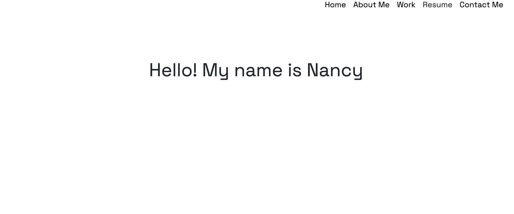
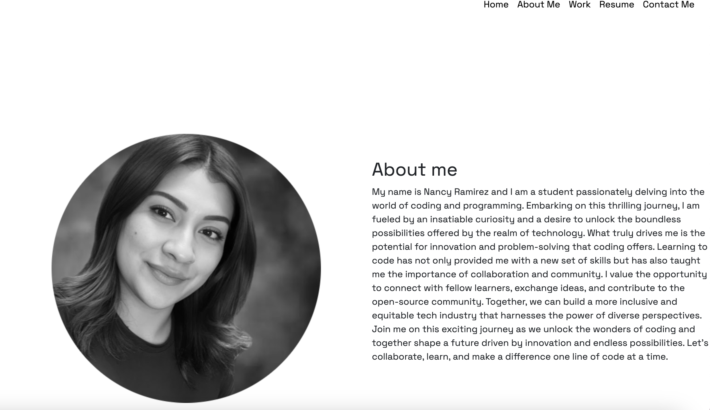
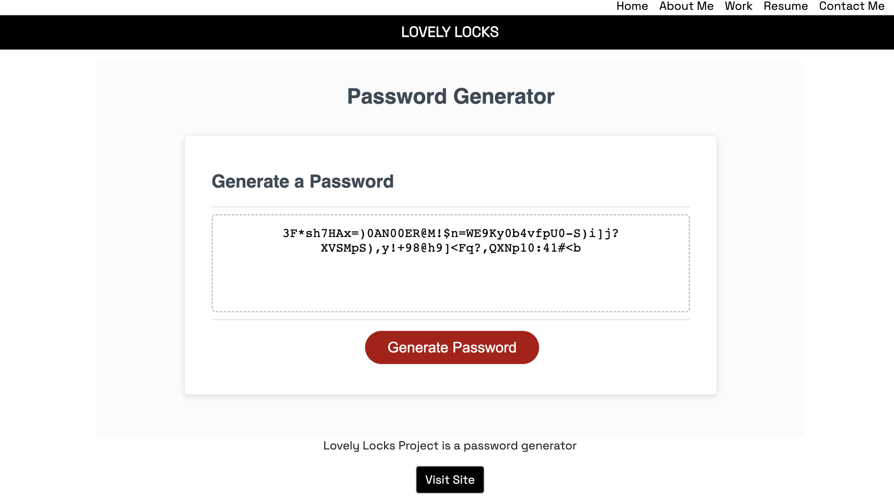
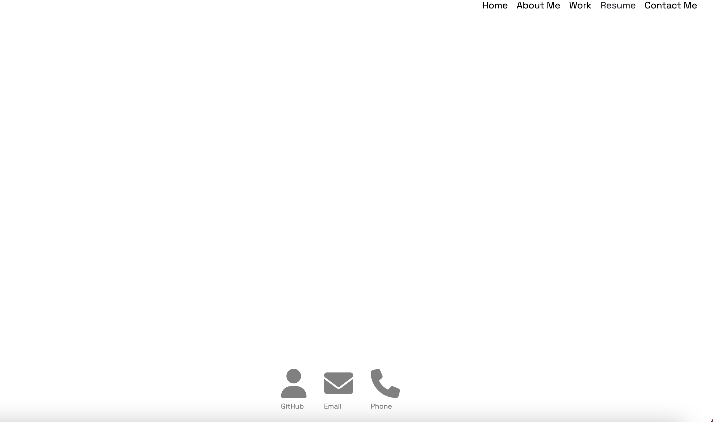

# ProfolioVibes

Welcome to Challenge 2 Project!

## **Project Description**

This was a challenge project in which I needed create a profolio with no previous code, it was a challenging task but I'm proud of my very first website!

## **Installation Instructions**

To be able to access the project you won't need to install any new tools, just simply use your browser.

## **How To Use The Project**

The project required the following acceptance critiria

- A profolio that includes the developers name, a photo, and links to sections about them, their work and how to contact them.
- A UI with navigation links to the sections
- A work section with developer's applications (I put in a place holder since I haven't crated any applications yet)
- First application image should be the biggest
- Resize responsive layout that adapts to different viewpoint

## **License**

This project is released under the MIT License. Feel free to use the challenges and solutions provided here for personal or educational purposes.

## **Deployed Website Link**

https://nramirez686.github.io/ProfolioVibes/

