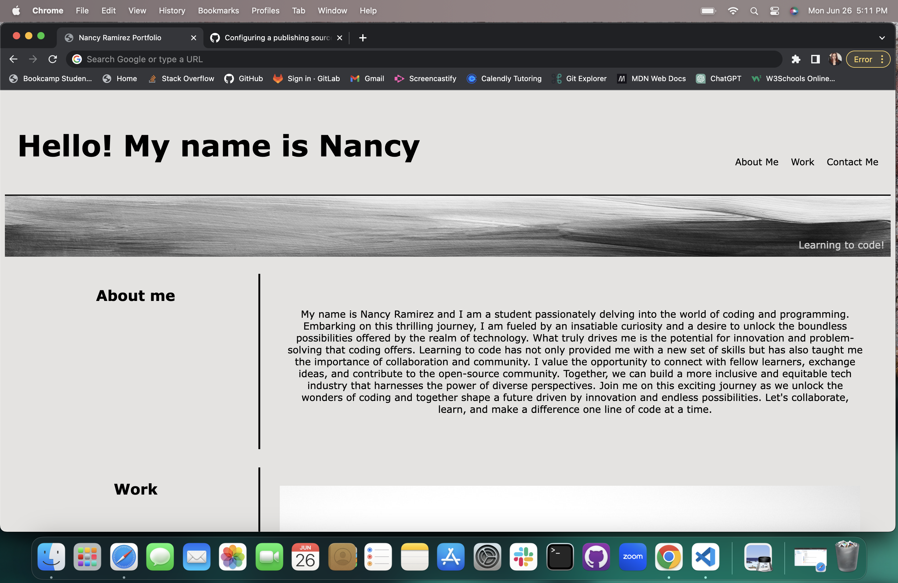

# ProfolioVibes

# Horiseon-Website

Welcome to Challenge Week 2 Project!

## **Project Description**

This was a challenge project in which I needed to create a profolio with no preveious code. It was a challenge but I'm proud of my very first build using HTML and CSS.

## **Installation Instructions**

To be able to access the project you won't need to install any new tools, just simply use your browser.

## **How To Use The Project**

The project required the following acceptance critiria

- When opening the page, being presented by a developers name, a photo, links to sections about them, and their work, and how to contact them.
- A UI that scrolls to to corresponding sections.
- When seeing the images being able to deploy to the application in the image (however, I don't have any applications to deploy yet but will be adding those in as the course progresses.)
- When resizing the page you're able to see the layout in various screens with a responsive layout.

## **License**

This project is released under the MIT License. Feel free to use the challenges and solutions provided here for personal or educational purposes.

## **Deployed Website Link**

https://nramirez686.github.io/ProfolioVibes/#contact-me

